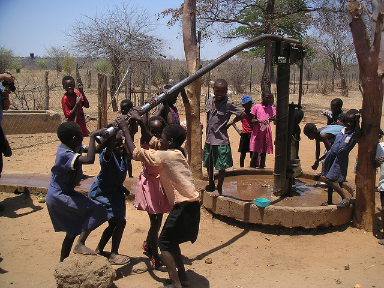
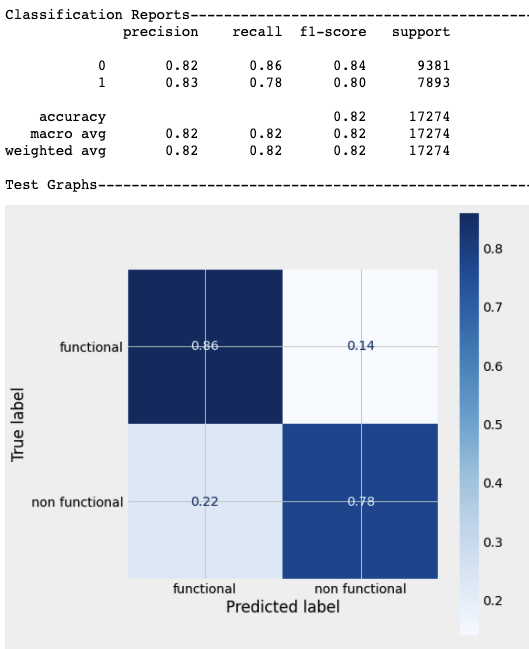
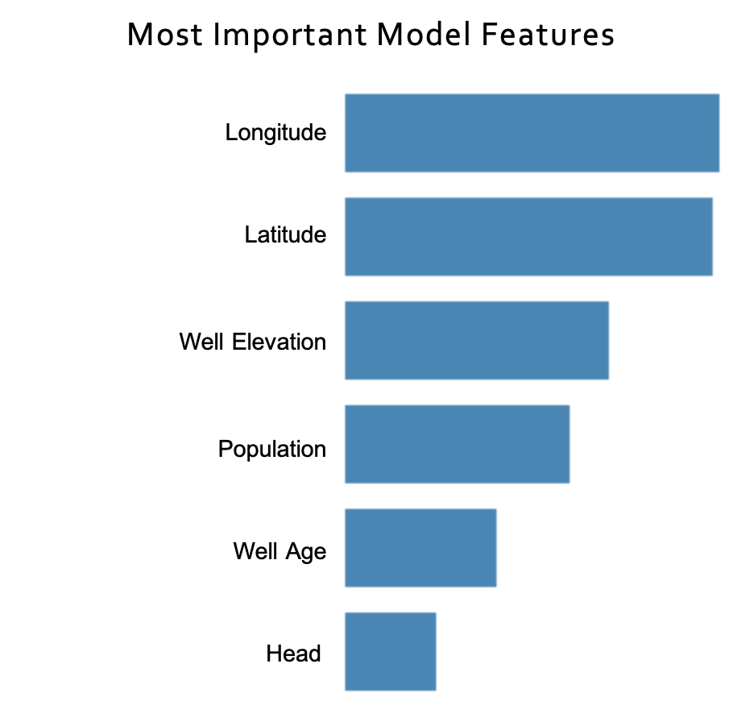
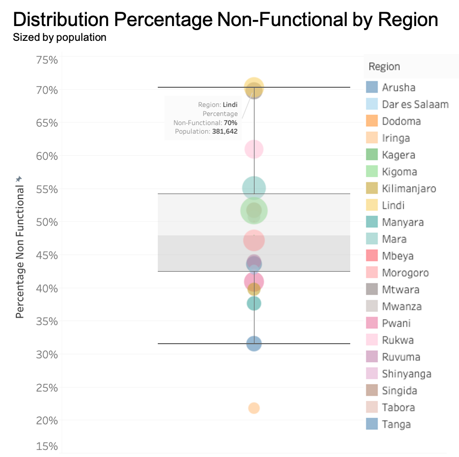

# Predicting Water Well Failures in Tanzania

# Overview

The Tanzanian Ministry of Water tracks vital information on water wells in its country to best ensure citizens are provided with a continual source of fresh water. A dataset housing this crucial information can be found [HERE](https://www.drivendata.org/competitions/7/pump-it-up-data-mining-the-water-table/page/23/). 

I will be utilizing this dataset to train a classification model to accurately predict which water wells are not functional and also to gain insights into potential reasons for water well failures. [THIS](https://public.tableau.com/app/profile/brian8863/viz/TanzanianWaterWellImpactDashboard/Dashboard1) business insights dashboard was developed specifically for stakeholders to visually explore the dataset to gain insights.

# Business Problem

It is undoubtedly obvious how crucial a consistent water supply is to every living thing in this world. Without it, life is not sustainable. A human can survive without food on average for about 1 to 2 months. However, a human can only survive 3 days without water! This time-frame without water can be shortened even further in climates which are extremely hot and humid. Tanzania, located on the east coast of Africa on the Indian Ocean, has parts of the country that are extremely hot and humid. The average high and low temperature in the most populous city of Dar es Salaam during the year is 86F and 70F, respectively. Dar es Salaam is located on the coast and has a average relative humidity of 70%. 

It is, therefore, extremely imperative to be able to supply a consistent source of fresh water for sustainment of human life in Tanzania. This begins with the evaluation of water wells in Tanzania with an emphasis on how reliability can be maximized to ensure a consistent supply of water is attainable. Unfortunately, our reliance on equipment (in this case a mechanical pump) means that 100% reliability can never be achieved. It is best to consider both reliability of the equipment and how quickly we can respond to an equipment failure and get it back to a running state. The response time to fixing a mechanical failure can be shortened with first predicting which water wells will fail. This key information can help maintenance organizations to ensure they have labor, tools and supplies ready to be mobilized in case of a failure. I will use machine learning to build a model to best predict water well failures in an attempt to understand what improvements can be made to factors such as funding, technology and maintenance operations.


# Data

The dataset has information on 59,400 water wells in Tanzania, for which only 55% are fully operational based on this dataset. Information on these water wells includes many important factors that impact their operability and will be explored in order to provide insight into how reliability, and therefore accessibility, can be maximized. I will clean and explore the data to best be utilized with a classification machine learning model to predict failure. Some of the important features are:
- Well Age
- Static Head
- Population around the well
- Well Location

It is worth noting that there were many numeric columns which had a high percentage of zeros in the dataset. Most notably, there were almost 19,000 water wells with zeros in construction year, head, well_elevation and population. While zeros for head and well elevation are acceptable numbers, I do believe these are most likely placeholders for  unknown values. Imputation of these values was completed in order to maximize the classification model.

# Methods

Since a reliable source of water is so imperative to human survival, I believe the best model will prioritize determining which wells are not functioning even if that means that there are false positives. This is primarily due to the high cost of leaving a subset of the population without water for any given time. This approach will mean more money and time is spent on preventative maintenance ahead of the well failing, but should ensure the best reliability. In the context of a classification model, the model will be evaluated to maximize recall. Recall aims to maximize identifying true positives even if it means there will be false negatives. I specifically chose to use highly interpretable models in order to have a more clear understanding of which well features are helpful in making the classification choices.

# Results

The best model for predicting well failure was a Random Forest. The model results are below:



The Random Forest model has the benefit of interpretability and determined that the following features were the most important in delivering a 77% Recall score for identifying a non-functional water well:



The features I explored more in detail based on these feature importances were the following:
1. Location (Latitude and Longitude)
2. Well Age
3. Static Head

## Location

The location of the water well proved to be a highly volatile feature as regions inside Tanzania had vastly different failure rates. The region of Lindi has a failure rate of 70% (70% of the wells in that region are non-functional) and a population of 381,642 that it must supply with water. 


## Static Head

Static head is the amount of pressure delivered at the water well in feet of head. For instance, if a water well has 1000 feet of head and the water is fresh water, the pressure would be 433 psi. Static head and non-functional wells seem to correlate pretty drastically. Static head and water quantity also seem to correlate. The analysis shows that the amount of static head a well has can be quite telling to how funtional the well is and at what water delivery capacity. 


## Well Age

Well Age was an engineered feature created from the construction year of the well and the estimated as-of-date of 2013. Well Age correlates very highly with well function. Deeper analysis shows that as a well ages, especially beyond 24 years, the well has a higher liklihood of being non-functional.


# Conclusions

Due to how important a sufficient and reliable water supply is to humanity, being able to accurately classify wells which are not functional is potentially live saving. While more sophisticated models will be explored in the future, I made the strategic choice to first utilize models which allowed for a deeper understanding of which features or important. This has proven to produce the following actionable insights:
1. Because there are so many features which impact well reliability, the Tanzanian government should strive to develop a close working relationship with locals around water wells to ensure that when wells are malfunctioning or aren't supplying an adequate amount of water to fulfill the population demands.
2. Keep a close eye on wells after they hit age 24. The analysis shows that there is a higher likelihood of a well being non-functional after hitting age 24. 
3. Improve data governance to increase data quality with respect to numerical features such as `head`, `well_elevation`, `population` and `construction_year`. Having accurate data will lead to a better classification model and a more efficient use of maintenance time and resources. 

## **For More Information**

Please review our full analysis in the [Jupyter Notebook](https://github.com/bentson1187/phase_3_project/blob/a269d0a37e0a12fe16d7ace0ae8eab89098626cd/Bentson,%20Brian%20Phase%203%20Project.ipynb) or [presentation](https://github.com/bentson1187/phase_3_project/blob/a269d0a37e0a12fe16d7ace0ae8eab89098626cd/Stakeholder%20Presentation.pptx). Additionally, a Tableau dashboard has been put together for exploratory data analysis [HERE](https://public.tableau.com/app/profile/brian8863/viz/TanzanianWaterWellImpactDashboard/Dashboard1).

For any additional questions, please contact **Brian Bentson, bentson.brian@gmail.com**

## Repository Structure

Describe the structure of your repository and its contents, for example:

```
├── README.md                           <- The top-level README for reviewers of this project
├── Bentson,Brian Phase 3 Project.ipynb <- Narrative documentation of analysis in Jupyter notebook
├── Stakeholder Presentation.ppt        <- Project presentation
├── Data                                <- Both sourced externally and generated from code
└── Images                              <- Both sourced externally and generated from code
```
